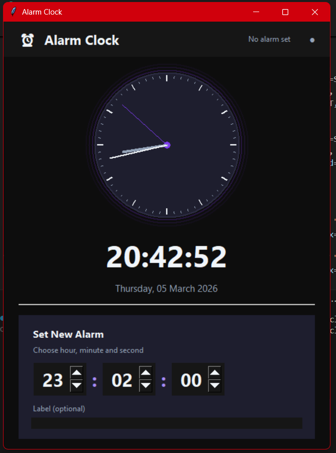

# 🕐 Modern Dark Alarm Clock

<p align="center">
  
</p>

<p align="center">
  A sleek, feature-rich alarm clock application built with Python and Tkinter, featuring a stunning dark-theme UI with an animated analog clock face.
</p>

<p align="center">
  
  
  
  
</p>

---

## ✨ Features

- 🕰️ **Animated Analog Clock** — Smooth-moving hour, minute, and second hands rendered on a custom canvas
- 🔢 **Live Digital Clock** — Real-time digital time display with full date (day, month, year)
- ⏰ **Multiple Alarms** — Add and manage as many alarms as you need
- 🏷️ **Alarm Labels** — Optionally name each alarm for easy identification
- 🔔 **Visual Ring Animation** — The digital clock flashes when an alarm triggers
- 🔊 **System Sound Alert** — Uses the system beep for audio notification
- ✅ **Toggle Alarms On/Off** — Enable or disable individual alarms without deleting them
- 🗑️ **Delete Alarms** — Remove alarms with a single click
- 🌙 **Modern Dark Theme** — Deep navy/purple dark palette with accent colours and subtle hover effects
- 🖱️ **Hover Effects** — Smooth interactive button highlights throughout the UI

---

## 🖼️ Preview

| Feature | Description |
|---|---|
| Analog Face | Circular clock with tick marks, hour markers, and coloured hands |
| Digital Display | Large bold time + formatted date beneath the clock |
| Set New Alarm | Spinner inputs for Hour, Minute, Second + optional label |
| Alarm List | Scrollable list of alarms with toggle and delete controls |
| Status Bar | Header shows "No alarm set" or the next scheduled alarm time |

---

## 🚀 Getting Started

### Prerequisites

- Python **3.10** or higher
- `tkinter` (bundled with standard Python on Windows & macOS)
- No third-party packages required

### Installation

```bash
# Clone the repository
git clone https://github.com/vaibhavchauhan-15/PYTHON-PROJECT.git

# Navigate to the project directory
cd PYTHON-PROJECT
```

### Run the App

```bash
python alarm_clock.py
```

---

## 🎮 How to Use

1. **View the current time** — The analog and digital clocks update every second automatically.
2. **Set an alarm** — Use the spinner controls at the bottom to choose **Hour**, **Minute**, and **Second**.
3. **Add a label** *(optional)* — Type a name for your alarm in the label field (e.g., "Morning Run").
4. **Click "Add Alarm"** — The alarm appears in the list above.
5. **Toggle an alarm** — Click the green **ON** / red **OFF** button to enable or disable an alarm.
6. **Delete an alarm** — Click the **✕** button next to any alarm to remove it.
7. **Alarm triggers** — When the time matches, the clock flashes and the system beep sounds.

---

## 📁 Project Structure

```
PYTHON-PROJECT/
├── alarm_clock.py   # Main application source file
├── image.png        # App screenshot
└── README.md        # Project documentation
```

---

## 🛠️ Tech Stack

| Technology | Purpose |
|---|---|
| **Python** | Core language |
| **Tkinter** | GUI framework & canvas rendering |
| **threading** | Background alarm monitoring loop |
| **winsound / os** | System beep for alarm sound |
| **datetime** | Time tracking and alarm comparison |

---

## 🎨 Design Highlights

The UI uses a carefully chosen dark colour palette:

| Token | Hex | Usage |
|---|---|---|
| Background | `#0F0F1A` | Main window background |
| Surface | `#1A1A2E` | Card / panel backgrounds |
| Accent | `#7C3AED` | Clock center dot & highlights |
| Success | `#10B981` | Active alarm indicator |
| Danger | `#EF4444` | Delete button & off-state |
| Text | `#F1F5F9` | Primary text |
| Text Dim | `#94A3B8` | Secondary / muted text |

---

## 👤 Author

**Vaibhav Chauhan**  
GitHub: [@vaibhavchauhan-15](https://github.com/vaibhavchauhan-15)

---

## 📄 License

This project is open source and available under the [MIT License](https://opensource.org/licenses/MIT).
